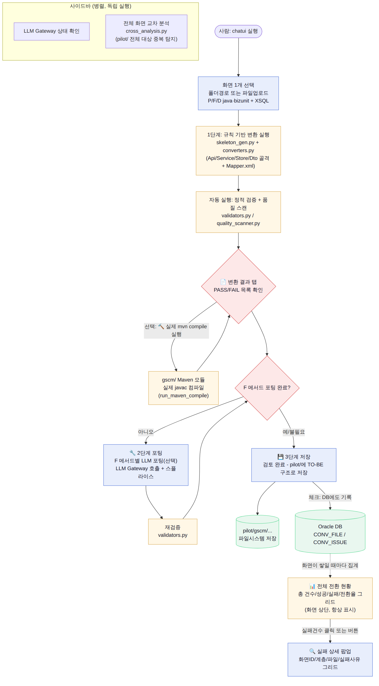
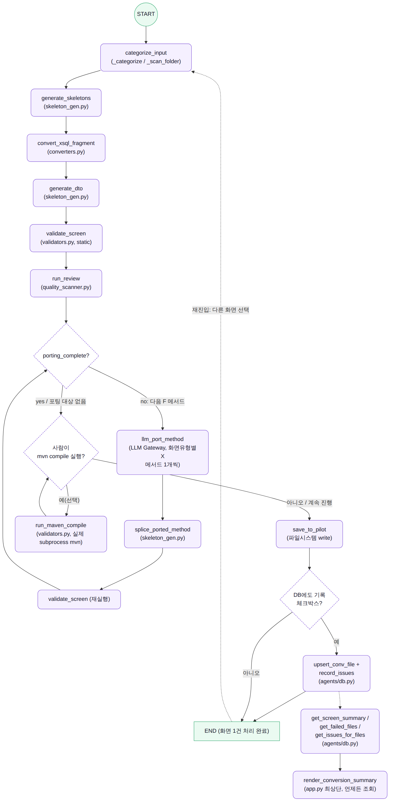

# chatui 업무 플로우 / 함수 단위 흐름 그래프 (2026-08-27, 현재 소스 기준)

> 이 문서의 두 다이어그램은 `chatui/app.py`, `chatui/skeleton_gen.py`, `chatui/converters.py`, `chatui/validators.py`, `chatui/quality_scanner.py`, `agents/db.py`의 **실제 현재 코드**를 그대로 반영한다 - CLAUDE.md Phase 4~5(Analyzer/Planner/Translator/Validator 멀티에이전트, 아직 미착수)의 미래 구상이 아니다. 소스가 바뀌면 이 문서도 같이 갱신해야 한다.

## 1. 업무 플로우 (사람이 실제로 하는 작업 단위)



화면 하나를 고르면(폴더 경로 또는 파일 업로드) 1단계(규칙 기반 변환) → 자동 정적 검증/품질 스캔 → (선택) 실제 `mvn compile` → 2단계(F 메서드별 LLM 포팅, 포팅 완료까지 반복) → 3단계(검토 후 `pilot/`에 저장, 선택적으로 DB 기록) 순서로 진행된다. DB에 쌓인 기록은 화면 상단의 "📊 전체 전환 현황" 그리드에 실시간으로 집계되고, 실패 건수를 클릭하면 파일별 실패 사유 팝업(그리드)이 뜬다. 사이드바의 LLM Gateway 상태 확인과 전체 화면 교차 분석(`cross_analysis.py`)은 화면 선택과 무관하게 독립적으로 실행 가능하다.

원본: [`diagrams/workflow.mmd`](diagrams/workflow.mmd) (Mermaid). 재생성:
```
npx -y @mermaid-js/mermaid-cli -i docs/diagrams/workflow.mmd -o docs/diagrams/workflow.png -b white --scale 2
```

## 2. 랭그래프 스타일 함수 단위 상태 그래프

> CLAUDE.md 기술 스택: "오케스트레이션은 사내 GaiA 프레임워크 우선, 한계 확인되면 LangGraph 검토" - 즉 이 프로젝트는 **LangGraph를 아직 실제로 쓰지 않는다.** 아래 그래프는 LangGraph 라이브러리 연동이 아니라, 현재 파이프라인을 LangGraph의 노드/조건부 엣지 관용구로 표현한 것이다(사람이 그 구조를 한눈에 보기 위함).



노드는 실제 함수/모듈 이름 그대로다(`categorize_input`→`generate_skeletons`→`convert_xsql_fragment`→`generate_dto`→`validate_screen`→`run_review`, 이후 `porting_complete?` 조건부 분기로 `llm_port_method`/`splice_ported_method`를 필요한 만큼 반복). `mvn compile` 실행과 DB 기록은 실제 코드와 동일하게 사람이 트리거하는 조건부 분기로 표시했다 - 자동으로 이어지지 않는다(CLAUDE.md "Translator/Validator 분리" 원칙과 지난 세션의 정적검증↔실제컴파일 분리 확인이 그대로 반영됨).

원본: [`diagrams/langgraph.mmd`](diagrams/langgraph.mmd). 재생성 명령은 위와 동일(파일명만 `langgraph`로 교체).

## 렌더링 방법 (참고)

이 환경엔 Node.js와 사전 설치된 Chromium이 있어 `@mermaid-js/mermaid-cli`(mmdc)로 직접 PNG를 만들었다:
```
export PUPPETEER_EXECUTABLE_PATH=/opt/pw-browsers/chromium-1194/chrome-linux/chrome
npx -y @mermaid-js/mermaid-cli -i <입력>.mmd -o <출력>.png -b white --scale 2 \
  --puppeteerConfigFile <(echo '{"args": ["--no-sandbox"]}')
```
Chromium 설치 경로(`chromium-1194` 등 버전 디렉터리명)는 환경마다 다를 수 있다 - `find /opt/pw-browsers -name chrome` 등으로 실제 경로를 먼저 확인할 것.
